# Architecture

goldenthread is a **schema compiler** that transforms Go domain models into TypeScript validation code.

## Core Principle

```
Go structs → Type-Aware Parsing → Schema IR → Zod Generation → TypeScript
```

goldenthread is **build-time only**. There is no runtime library, no reflection overhead, no magic. It's pure code generation, like `sqlc`, `gqlgen`, or `protoc`.

## v0.1 Scope

The current implementation focuses on the core use case: **generating Zod schemas from Go structs**. Future versions may add OpenAPI, JSON Schema, or other emitters based on real-world usage.

## System Components

```mermaid
flowchart TB
    subgraph input["Input Layer"]
        gosrc[Go Source Files<br/>with gt: tags]
        gomod[go.mod<br/>Module Context]
    end
    
    subgraph loader["Package Loading"]
        gopkg[go/packages<br/>Type-aware loading]
        gotypes[go/types<br/>Type resolution]
    end
    
    subgraph parser["Parser Layer"]
        ast[AST Walker<br/>Find exported structs]
        extract[Tag Extraction<br/>gt: and json: tags]
        resolve[Type Resolution<br/>Cross-package refs]
    end
    
    subgraph ir["Intermediate Representation"]
        schema[Schema IR<br/>Language-agnostic]
        field[Field Types<br/>Validation Rules]
    end
    
    subgraph normalize["Normalization"]
        flatten[Flatten<br/>Embedded structs]
        collide[Detect<br/>Name collisions]
        validate[Semantic<br/>Validation]
    end
    
    subgraph hash["Hash/Drift"]
        sha[SHA-256<br/>Schema hash]
        meta[.goldenthread.json<br/>Metadata tracking]
    end
    
    subgraph emit["Emitter Layer"]
        codegen[Code Generation<br/>Zod schemas]
        format[TypeScript<br/>Formatting]
        types[Type Inference<br/>z.infer export]
    end
    
    subgraph output["Output Layer"]
        ts[Generated .ts Files<br/>Zod schemas]
        metadata[Metadata File<br/>Drift detection]
    end
    
    subgraph ci["CI Integration"]
        check[goldenthread check<br/>Verify sync]
        drift[Exit Code<br/>0=sync 1=drift]
    end
    
    gosrc --> gopkg
    gomod --> gopkg
    gopkg --> gotypes
    gotypes --> ast
    
    ast --> extract
    extract --> resolve
    resolve --> schema
    schema --> field
    
    field --> flatten
    flatten --> collide
    collide --> validate
    
    validate --> sha
    sha --> meta
    
    validate --> codegen
    codegen --> format
    format --> types
    
    types --> ts
    meta --> metadata
    
    metadata --> check
    sha --> check
    check --> drift
    
    style input fill:#3A4A5C,stroke:#6b7280,color:#f0f0f0
    style loader fill:#3A4C43,stroke:#6b7280,color:#f0f0f0
    style parser fill:#3A4A5C,stroke:#6b7280,color:#f0f0f0
    style ir fill:#4C4538,stroke:#6b7280,color:#f0f0f0
    style normalize fill:#3A4C43,stroke:#6b7280,color:#f0f0f0
    style hash fill:#4C3A3C,stroke:#6b7280,color:#f0f0f0
    style emit fill:#3A4A5C,stroke:#6b7280,color:#f0f0f0
    style output fill:#3A4C43,stroke:#6b7280,color:#f0f0f0
    style ci fill:#4C3A3C,stroke:#6b7280,color:#f0f0f0
```



### 1. Parser (`internal/parser`)

**Responsibility**: Extract schema definitions from Go source code with full type resolution.

**Input**: Go packages containing structs with `gt:` tags
**Output**: Schema IR (intermediate representation)

**Implementation**:
- Uses `go/packages` (not `go/parser`) for type-aware parsing
- Leverages `go/types` for proper type resolution and cross-package references
- Walks AST to find exported struct definitions
- Extracts field types, tags, and documentation comments
- Resolves embedded structs and nested type references
- Handles `time.Time` and other standard library types

**Example**:

```go
// Input Go code
type User struct {
    Username string `json:"username" gt:"required,len:3..20"`
    Email    string `json:"email" gt:"email"`
}

// Parser extracts
Schema{
    Name: "User",
    PackageName: "models",
    Fields: []Field{
        {
            GoName: "Username",
            JSONName: "username",
            Type: Type{Kind: TypeString},
            ValidationRules: ValidationRules{
                Required: ptr(true),
                MinLength: ptr(3),
                MaxLength: ptr(20),
            },
        },
        {
            GoName: "Email",
            JSONName: "email",
            Type: Type{Kind: TypeString},
            ValidationRules: ValidationRules{Email: ptr(true)},
        },
    },
}
```

### 2. Schema IR (`internal/schema`)

**Responsibility**: Language-agnostic intermediate representation.

The Schema IR is the core data structure that decouples parsing from code generation. It represents validation rules in a way that can be emitted to any target language.

**Key Types**:

```go
type Schema struct {
    Name            string
    PackageName     string
    Fields          []Field
    Documentation   string
    SourceFile      string
}

type Field struct {
    GoName          string   // Go field name
    JSONName        string   // JSON field name from json tag
    Type            Type     // Field type information
    ValidationRules ValidationRules
    Documentation   string   // Go doc comment
    IsEmbedded      bool     // True for embedded structs
}

type Type struct {
    Kind       TypeKind  // string, int, float, bool, array, map, object, time
    GoType     string    // Original Go type name
    IsPointer  bool      // True for pointer types (*string)
    ElementType *Type    // For arrays/slices: element type
    KeyType    *Type     // For maps: key type
    ValueType  *Type     // For maps: value type
    SchemaRef  string    // For nested objects: reference to schema name
}

type ValidationRules struct {
    // Presence
    Required *bool
    Optional *bool
    
    // String rules
    MinLength *int
    MaxLength *int
    Pattern   *string
    
    // Format validators
    Email    *bool
    UUID     *bool
    URL      *bool
    Date     *bool
    DateTime *bool
    IPv4     *bool
    IPv6     *bool
    
    // Numeric rules
    Min *float64
    Max *float64
    
    // Enum
    Enum []string
    
    // Array rules
    MinItems *int
    MaxItems *int
}
```

**Why a separate IR?**

1. **Decouples concerns**: Parser doesn't know about Zod, emitters don't know about Go AST or `go/types`
2. **Extensibility**: New emitters (OpenAPI, JSON Schema) only need to understand IR
3. **Validation**: IR enables normalization and collision detection before codegen
4. **Testing**: Can test parser and emitters independently with fixtures
5. **Determinism**: IR provides stable input for hash-based drift detection

### 3. Normalization (`internal/normalize`)

**Responsibility**: Validate and transform Schema IR before code generation.

**Operations**:
1. **Embedded struct flattening**: Promotes embedded struct fields to parent
2. **Collision detection**: Finds duplicate JSON names (compile-time error)
3. **Go field collision detection**: Finds Go name conflicts from embedding
4. **Validation**: Ensures schema is semantically correct

**Example**:

```go
// Input schema with embedded struct
type Timestamps struct {
    CreatedAt string `json:"created_at"`
}

type User struct {
    Timestamps  // Embedded
    Name string `json:"name"`
}

// Normalized schema (fields flattened)
Schema{
    Name: "User",
    Fields: [
        {JSONName: "created_at", GoName: "CreatedAt", ...},
        {JSONName: "name", GoName: "Name", ...},
    ],
}
```

If two embedded structs both define `created_at`, normalization detects the collision and fails with a clear error.

### 4. Emitter (`internal/emitter/zod`)

**Responsibility**: Generate TypeScript with Zod validation schemas from normalized IR.

**Input**: Normalized `Schema` IR
**Output**: TypeScript file with Zod schemas and inferred types

**Example**:

```typescript
// Generated from User schema in models/user.go
import { z } from "zod";

export const UserSchema = z.object({
  username: z.string().min(3).max(20),
  email: z.string().email(),
});

export type User = z.infer<typeof UserSchema>;
```

**Design Decisions**:
- Always export both schema constant and inferred type
- Use `.optional()` for pointer types
- Generate camelCase field names from JSON names when missing
- Preserve Go documentation as JSDoc comments
- Escape special characters in regex patterns (/, \n, \t, \r)
- Handle UTF-8 properly (use rune slicing, not byte slicing)
- Deterministic output for stable git diffs

**UTF-8 Handling**:

The emitter was initially buggy with multi-byte UTF-8 characters. Fuzzing discovered that `camelCase()` used byte slicing which corrupted Japanese field names. Fixed by using rune slicing:

```go
// Bug: byte slicing breaks UTF-8
func camelCase(s string) string {
    return strings.ToLower(s[:1]) + s[1:]  // ❌
}

// Fix: rune slicing preserves characters
func camelCase(s string) string {
    runes := []rune(s)
    if len(runes) > 0 {
        runes[0] = []rune(strings.ToLower(string(runes[0])))[0]
    }
    return string(runes)  // ✅
}
```

**Future Emitters** (not implemented in v0.1):
- OpenAPI 3.0 emitter for API documentation
- JSON Schema emitter for generic validation
- Plain TypeScript interface emitter (no validation)

### 5. Hash/Drift Detection (`internal/hash`)

**Responsibility**: Detect when generated code is out of sync with source.

**Implementation**:
- SHA-256 hash of normalized Schema IR (stable, deterministic)
- Stores hashes in `.goldenthread.json` metadata file
- `check` command compares current schema hash with stored hash
- Ignores documentation changes (only structural/validation changes matter)

**Why hash the IR, not the source?**

1. **Semantic stability**: Documentation changes don't affect schemas
2. **Determinism**: Normalized IR is canonical representation
3. **Fast comparison**: Hash comparison is O(1)

**Example metadata** (`.goldenthread.json`):

```json
{
  "version": 1,
  "schemas": [
    {
      "name": "User",
      "package": "models",
      "hash": "a3f2b8c...",
      "source_file": "models/user.go"
    }
  ]
}
```

**CI Integration**:

```yaml
- name: Check schema drift
  run: goldenthread check ./models
```

Exit code 1 if drift detected, 0 if in sync.

### 6. Package Loading (`internal/load`)

**Responsibility**: Wrapper around `go/packages` for reliable package loading.

**Key Features**:
- Sets up proper Go module context
- Handles working directory for package resolution
- Configures `go/packages` with type information mode
- Used by both production parser and fuzz tests

**Why a separate package?**

Fuzz tests need to load temporary test packages with `go.mod` files. Centralizing the loading logic ensures consistency.

### 7. CLI Tool (`cmd/goldenthread`)

**Responsibility**: User-facing command-line interface.

**Commands**:

```bash
# Generate Zod schemas from Go structs
goldenthread generate ./models

# Generate with specific output directory
goldenthread generate ./models --out ./frontend/src/schemas

# Generate recursively through subdirectories
goldenthread generate ./models --recursive

# Verify schemas are up-to-date (CI)
goldenthread check ./models

# Display version
goldenthread version
```

**Flags**:

- `--out <dir>`: Output directory (default: `./gen`)
- `--recursive`: Process subdirectories recursively
- `--target <name>`: Target emitter (default: `zod`, only option in v0.1)

**No configuration file in v0.1**: All options via flags. Future versions may add `goldenthread.yaml` for project-wide settings.

## Data Flow

### Generation Flow

```
1. CLI invoked with directory path
   ↓
2. Package loading (internal/load)
   - Run go/packages with type information
   - Load package AST and type data
   ↓
3. Parsing (internal/parser)
   - Walk AST for exported structs
   - Extract gt: tags and json: tags
   - Resolve types with go/types
   - Create Schema IR for each struct
   ↓
4. Normalization (internal/normalize)
   - Flatten embedded struct fields
   - Detect JSON name collisions → error
   - Detect Go name collisions → error
   - Validate semantic correctness
   ↓
5. Hashing (internal/hash)
   - SHA-256 hash of normalized schema
   - Generate deterministic hash
   ↓
6. Emission (internal/emitter/zod)
   - Generate TypeScript code
   - Format with proper indentation
   - Add imports and exports
   ↓
7. File I/O
   - Write <schema>.ts to output directory
   - Write .goldenthread.json metadata
   - Report generated files
```

### Check Flow (CI)

```
1. CLI invoked with 'check' command
   ↓
2. Load packages and parse (same as generate)
   ↓
3. Normalize schemas
   ↓
4. Hash schemas (SHA-256)
   ↓
5. Read .goldenthread.json metadata
   ↓
6. Compare current hash vs. stored hash
   ↓
7. If mismatch:
      - Print which schemas drifted
      - Exit code 1 (fail CI)
   If match:
      - Print "All schemas in sync"
      - Exit code 0 (pass CI)
```

## Design Principles

### 1. No Runtime Dependencies

Generated code has **zero** dependency on goldenthread. Users only depend on:
- `zod` npm package
- TypeScript (for type inference)

The generated `.ts` files are standalone and can be committed to version control.

### 2. Readable Generated Code

Generated code looks hand-written:
- Clear formatting with proper indentation
- Descriptive variable names
- Standard TypeScript conventions
- No code comments (clean output)

Example:

```typescript
import { z } from "zod";

export const UserSchema = z.object({
  username: z.string().min(3).max(20),
  email: z.string().email(),
});

export type User = z.infer<typeof UserSchema>;
```

### 3. Type-Aware Parsing

Uses `go/packages` and `go/types` for correct type resolution:
- Understands `time.Time` → `z.string().datetime()`
- Resolves cross-package struct references
- Handles embedded structs correctly
- Distinguishes pointer vs. non-pointer types

### 4. Explicit, Not Magic

No hidden conventions or surprises:
- Output directory explicit via `--out` flag
- Only generates from structs with `gt:` tags (opt-in)
- Drift detection requires explicit `check` command
- File names match schema names (User → user.ts)

## Testing Strategy

goldenthread has **53.4% test coverage** across three testing layers:

### 1. Unit Tests (39 tests)

Test individual components in isolation:

```go
// Parser: Tag parsing
func TestParseGTTag(t *testing.T) {
    tag := `required,len:3..20,email`
    rules := parseValidationRules(tag)
    assert.True(t, *rules.Required)
    assert.Equal(t, 3, *rules.MinLength)
    assert.Equal(t, 20, *rules.MaxLength)
}

// Emitter: Zod generation
func TestEmit_StringField(t *testing.T) {
    schema := &schema.Schema{
        Name: "User",
        Fields: []Field{{GoName: "Username", Type: Type{Kind: TypeString}}},
    }
    output, err := emitter.Emit(schema)
    assert.Contains(t, output, "z.string()")
}

// Hash: Determinism
func TestComputeSchemaHash_Deterministic(t *testing.T) {
    schema := createTestSchema()
    hash1 := ComputeSchemaHash(schema)
    hash2 := ComputeSchemaHash(schema)
    assert.Equal(t, hash1, hash2)
}
```

### 2. Integration Tests (8 tests)

Test component interactions with real Go packages:

```go
func TestParsePackages_RealGoCode(t *testing.T) {
    // Create temp package with go.mod
    tmpDir := t.TempDir()
    writeFile(tmpDir, "go.mod", "module test\ngo 1.23")
    writeFile(tmpDir, "user.go", `
        package test
        type User struct {
            Username string ` + "`json:\"username\" gt:\"required\"`" + `
        }
    `)
    
    // Load with go/packages
    pkgs, err := load.LoadPackagesWithDir(tmpDir, ".")
    assert.NoError(t, err)
    
    // Parse
    p := parser.NewParser()
    schemas, err := p.ParsePackages(pkgs)
    assert.NoError(t, err)
    assert.Len(t, schemas, 1)
}
```

### 3. Fuzz Tests (12 targets)

**Continuous fuzzing** runs every 30 minutes in GitHub Actions, testing with random inputs:

```go
func FuzzEmit(f *testing.F) {
    // Seed corpus
    f.Add("User", "username", "email")
    f.Add("日本語", "フィールド", "")  // Found UTF-8 bug
    
    f.Fuzz(func(t *testing.T, schemaName, fieldGoName, fieldJSONName string) {
        schema := &schema.Schema{
            Name: schemaName,
            Fields: []Field{{
                GoName: fieldGoName,
                JSONName: fieldJSONName,
                Type: Type{Kind: TypeString},
            }},
        }
        
        output, err := emitter.Emit(schema)
        if err != nil {
            return  // Expected for invalid inputs
        }
        
        // Generated code must be valid UTF-8
        if !utf8.ValidString(output) {
            t.Error("Invalid UTF-8 output")  // This caught the bug!
        }
    })
}
```

**Fuzz targets**:
- Parser: Random struct definitions and tags
- Emitter: Random schema configurations (5 targets)
- Hash: Determinism with random schemas (5 targets)

**Bugs found by fuzzing**:
1. **UTF-8 corruption** in `camelCase()` - Found after 444,553 executions
2. **Regex escaping** with newlines - Found after 180 executions

See [TESTING.md](TESTING.md) for complete testing guide and [FUZZING_BUGS.md](FUZZING_BUGS.md) for bug details.

## Future Extensions

These features are **not implemented in v0.1** but may be added based on real-world usage:

### Additional Emitters

- **OpenAPI 3.0**: Generate OpenAPI specs for API documentation
- **JSON Schema**: Generate JSON Schema for generic validation
- **TypeScript interfaces**: Plain types without Zod (smaller bundle size)
- **Go validator**: Generate Go-side validation from same tags

### Advanced Validation

- **Cross-field validation**: Password confirmation, date ranges
- **Custom validators**: User-defined validation functions
- **Conditional validation**: Rules that depend on other field values
- **Array uniqueness**: Ensure array elements are unique

### Type System Extensions

- **Union types**: Discriminated unions with type narrowing
- **Literal types**: Specific string/number values
- **Recursive types**: Self-referential schemas (trees, linked lists)
- **Tuple types**: Fixed-length arrays with different types

### Developer Experience

- **Watch mode**: Auto-regenerate on file changes
- **IDE plugin**: Real-time validation of `gt:` tags
- **Migration tool**: Convert existing validation libraries to `gt:` tags
- **Configuration file**: Project-wide settings in `goldenthread.yaml`

## Performance Considerations

### Build Time

For 1000 structs (estimated):
- Package loading: <1s (`go/packages` is efficient)
- Parsing + normalization: <1s
- Hashing: <100ms (SHA-256 is fast)
- Emission: <1s (string generation)
- File I/O: <200ms

**Total: ~2-3 seconds for 1000 schemas**

Acceptable for build-time tooling. Can be optimized with parallel processing if needed.

### Memory

Schema IR is lightweight (~1-2KB per schema in memory).

For 1000 schemas: ~2MB total.

No memory concerns. `go/packages` memory overhead is larger but handled by Go runtime.

## Summary

goldenthread is designed as a **compiler, not a library**. It transforms Go domain models into TypeScript validation code using a five-stage pipeline:

```
Go source → Parse → Normalize → Hash → Emit → TypeScript
            (AST)    (IR)      (drift) (Zod)   (generated)
```

Key architectural decisions:

1. **Type-aware parsing** with `go/packages` for correct type resolution
2. **Language-agnostic IR** for future emitter extensibility
3. **Normalization layer** catches errors before code generation
4. **Hash-based drift detection** for CI integration
5. **Deterministic output** for stable git diffs
6. **Continuous fuzzing** for automatic bug discovery

This architecture makes goldenthread extensible, testable, and maintainable while keeping generated code clean, readable, and dependency-free (only depends on `zod`).
